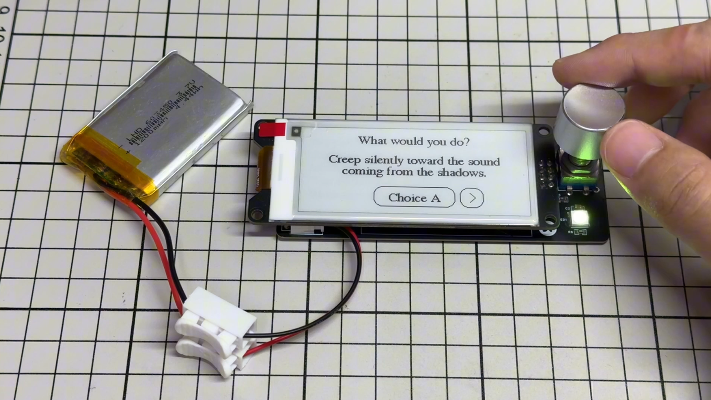
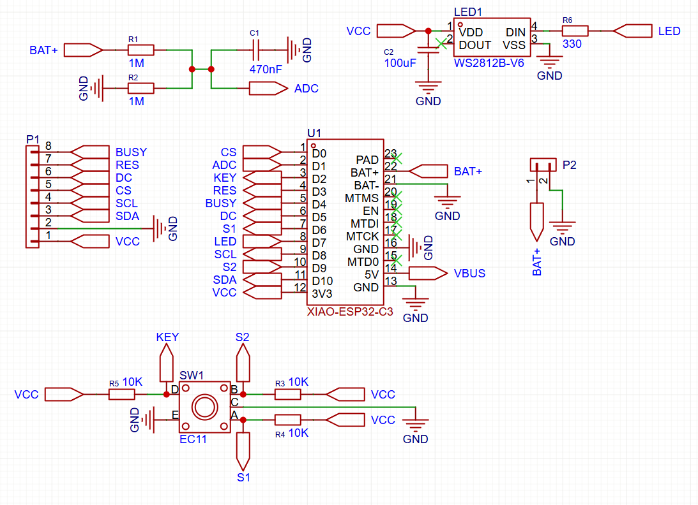

# InkQuest (WIP)
This is an AI-powered text adventure device using an ESP32, an e-paper display and a rotary encoder. It is powered by Gemini to generate infinite stories and choices.

## Design
InkQuest uses ESP32-C3 microcontroller to connect to WiFi and query the Gemini API. Gemini generates an interactive story segment and choices for the player in JSON format. Then the text is shown on the e-paper display. The user can use the rotary encoder to scroll through the text and select their next action. Each choice is returned to the history buffer on the ESP32 and is sent back to Gemini to generate the next story segment.

## Repository Structure
* `firmware/`: Arduino IDE flash code.
* `hardware/`: PCB Gerber files and schematics.
* `images/`: Project images.

## Bill of Materials (BOM)
| Component | Variation | Quantity | Link |
| -------- | -------- | -------- | -------- |
| XIAO ESP32-C3 | - | 1 | [AliExpress](https://s.click.aliexpress.com/e/_c3eOCW2h) |
| WeAct 2.9inch E-Paper Display | 2.9 inch | 1 | [AliExpress](https://s.click.aliexpress.com/e/_c4pj5khn) |
| 603450 Li-Po Battery | - | 1 | [AliExpress](https://s.click.aliexpress.com/e/_c3nU6hTJ) |
| JST-PH Connector | 2P | 1 | [AliExpress](https://s.click.aliexpress.com/e/_c3N3rmhr) |
| Rotary Encoder EC11 | 20mm D shaft | 1 | [AliExpress](https://s.click.aliexpress.com/e/_c4pAwN4D) |
| WS2812B NeoPixel LED 5050 | - | 1 | [AliExpress](https://s.click.aliexpress.com/e/_c4lxeFXX) |
| PH3.5 Low Profile Pin Connector | 2x4 Male, 2x4 Female | 2 | [AliExpress](https://s.click.aliexpress.com/e/_c2u2lpcp) |
| 0805 Resistor | 1M | 2 | [AliExpress](https://s.click.aliexpress.com/e/_c4bDhEHP) |
| 0805 Resistor | 330 | 1 | [AliExpress](https://s.click.aliexpress.com/e/_c4bDhEHP) |
| 0805 Resistor | 10K | 3 | [AliExpress](https://s.click.aliexpress.com/e/_c4bDhEHP) |
| 0805 Capacitor | 470nF | 1 | [AliExpress](https://s.click.aliexpress.com/e/_c2xbXOcz) |
| 0805 Capacitor | 100uF | 1 | [AliExpress](https://s.click.aliexpress.com/e/_c2xbXOcz) |

## PCB Schematics

## License
This project is licensed under the GNU General Public License v2.0. See the [LICENSE](LICENSE) file for details.
